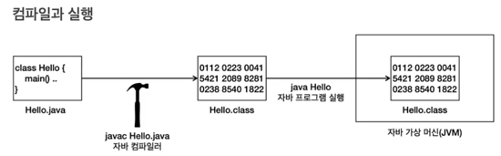

1주차는 예전에 배웠던 자바를 기억해내기 위한 개념공부이다. 점프 투 자바와 김영한 강사님 인프런 자바입문 강의를 참고하였다.
___
이번 공부의 목적은 흐릿해진 기본 구문을 눈과 손에 익히고, 클래스와 메서드 패키지같은 개념을 명확히 하는 것이다.
___
 
자바,인텔리제이의 컴파일 과정과 원리에 대해 알아보았다.
##### 패키지
비슷한 성격의 자바 클래스를 모아놓은 디렉토리, 즉 폴더로 생각하면 된다.클래스의 식별에 용이하다.
##### 클래스
연관된 변수와 메소드를 그룹화 한 것이다. 하나의 사물을 하나의 클래스로 설명할 수 있다.
##### 메소드
클래스의 기능을 의미하며, 수학에서 함수의 역할을 한다.<br/><br/>
더 세부적인 내용은 추후에 다루겠다.
___
##### 변수
변수에 대해선 자세히 정리하지 않고 주의할만한, 까먹을만한 것만 정리해두겠다.
실무에선 다른것들은 거의 사용하지 않고 int, long, boolean, double, string 만 사용한다고 생각해도 된다.<br/><br/>
또한 변수명명에 대한 규칙과 관례가 존재한다.
- 변수 이름은 숫자로 시작할 수 없다.
- 이름에는 공백이 들어갈 수 없다.
- 자바의 예약어를 변수 이름으로 사용할 수 없다.(int, class, public 등)
- 변수 이름에는 영문자, 숫자, $, _ 만 사용할 수 있다.
- 카멜케이스를 사용하는게 일반적. 소문자로 시작 후 다음 단어는 대문자로 시작(myAcoount)<br/><br/>
자바 언어에 대한 관례
- 클래스의 첫 글자는 대문자, 나머지는 모두 소문자 시작!
- - 클래스: Person,Detail
- - 변수를 포함한 나머지 : firstName, secondName
- 예외가 딱 두가지 있다.
- - 상수는 모두 대문자 사용하고 언더바로 구분(USER_LIMIT)
- - 패키지는 모두 소문자 사용. org.spring.boot

간단한 변수 퀴즈를 풀어보라고 한다.. (사실 이걸 풀어야하나 싶지만 그래도 풀겠다) 변수 사용하여 print하라는 요구다.
```
public class HelloJava {
    public static void main(String[] args) {
        int num1=3;
        int num2=4;
        System.out.println(num1+num2);
        System.out.println(num1*num2);
        System.out.println(num1-num2);
    }
}
```
변수1에 10,변수2에 20을 할당하고 그 합을 sum 변수에 저장 후 출력하라.
```
public class HelloJava {
    public static void main(String[] args) {
        int num1=10;
        int num2=20;
        int sum=num1+num2;
        System.out.println(sum);
    }
}
```
Long 타입의 변수 선언 후, 변수를 100억으로 초기화 하여 출력, boolean 타입의 변수 선언하고, true로 초기화하여 출력.
```
public class HelloJava {
    public static void main(String[] args) {
        long a=10000000000L;
        boolean b= true;
        System.out.println(a);
        System.out.println(b);
    }
}
```
___
##### 연산자
- 산술 연산자 : +,-,*,/,%(나머지 연산자)
- 증감 연산자 : ++,--
- 비교 연산자 : ==, !=, >, <, <=, >= (문자열 비교는 .equals())
- 논리 연산자 : &&(AND), ||(OR), !(NOT)
- 대입 연산자 : =, +=, -=, *=, /=, %=
- 삼항 연산자 : ? :

##### 문제
클래스 이름은 OperationEx1으로하고, num1,num2,num3 세 개의 int 변수 선언하고 10,20,30 으로 초기화. 세 변수 합 계산 후 sum이라는 int변수에 저장. 세 변수의 평균 계산 후, average라는 int변수에 저장. sum과 average 변수의 값 출력.
```
public class OperationEx1 {
    public static void main(String[] args){
        int num1=10;
        int num2=20;
        int num3=30;
        int sum=num1+num2+num3;
        int average=sum/3;
        System.out.println(sum);
        System.out.println(average);
    }
}
```
int형 변수 score선언. Score가 80점 이상이고, 100점 이하면 true, 아니면 false 출력.
```
public class OperationEx2 {
    public static void main(String[] args) {
        int score=80;
        boolean result=score>=80 && score<=100;
        System.out.println(result);
    }
}
```
___
##### if문 
은 딱히 정리할게 없어보인다.
##### swtich문
```
public class Switch {
    Switch( 조건식 ) {
        case value1:
            //실행코드
            break;
        default :
            //조건 어떤경우에도 해당하지 않을때.
    }
}
```
삼항 연산자는 자바에서 유일하게 항이 3개이다.
(조건) ? 참_표현식 : 거짓_표현식으로 작성할 수 있다.
##### 문제
학생의 점수를 기반으로 학점을 출력하는 자바 프로그램을 작성하자.
90점이상 A, 80이상 90미만 B, 70이상 80미만 C, 60이상 70미만 D, 60미만 F.
```
public class ScoreEx {
    public static void main(String[] args) {
        int score=85;
        if (score>=90)
            System.out.println("A");
        else if (80<=score)
            System.out.println("B");
        else if (70<=score)
            System.out.println("C");
    }
}
```
정수 x가 짝수이면 “짝수” 홀수이면 “홀수”를 출력하는 프로그램 삼항연산자 사용하여 작성.
```
public class ScoreEx {
    public static void main(String[] args) {
        int x=2;
        String result = (x%2==0) ? "짝수" : "홀수";
        System.out.println(result);
    }
}
```
___
##### 반복문 
while, do-while, for이 존재.<br/>
while 문은 
```
while (조건식) {
실행코드
}
```
do-while문은 조건에 상관없이 무조건 한 번은 코드를 실행.
```
do{
실행코드
} while (조건문)
```
break, continue
```
while(조건식) {
코드1
break; 즉시 while 종료
}
```
```
while(조건식){
코드1
continue; //즉시 조건으로 이동.
}
```
for문은 주로 반복횟수가 정해져있을때 사용.
```
for (int i=1; i<=10; i++)
{
}
```
int rows를 선언 후, 이 수만큼 다음과 같은 피라미드 출력.
```
public class Pyramid {
    public static void main(String[] args) {
        int rows=5;
        for (int i=1; i<=rows; i++) {
            for (int j=1; j<=i; j++){
                System.out.print("*");
            }
            System.out.println();
        }
    }
```
___
##### 지역변수와 스코프
지역변수란 특정 지역에서만 사용할 수 있는 변수이다. 코드 블록 안에서 선언한 변수는 블록 안에서만 사용 가능하다.<br/>
이렇게 변수의 접근 가능한 범위를 스코프라고 한다. 비효율적인 메모리 사용과 코드 복잡성을 피하기 위해 변수를 잘 선언해주어야 한다.<br/>
##### 형변환
작은 범위에서 큰 범위는 당연히 값을 넣을 수 있다. 다만 반대의 경우는 소수점버림, 오버플로우가 발생할 수 있다.
```
public static void main(String[] args) {
        int rows = 5;
        double doublerows;
        doublerows =(double) rows;
        System.out.println(doublerows);
    }
```
- 같은 타입끼리의 계산은 같은 타입의 결과를 낸다. int+int=int,double+double=double
- 서로 다른 타입의 계산은 큰 범위로 자동 형변환이 일어난다. int+long은 long+long으로 int+double은 double+double
___
##### Scanner<br/>
바로 문제로 가보자..
- 사용자로부터 상품정를 입력받고, 총 가격을 출력하는 프로그램 작 사용자는 여러상품 추가하고 결제가능하고 언제든 종료가능.
-  1. 상품입력 2.결제 3.프로그램 종료 옵션을 정수로 입력받도록 제공
- 상품 입력 옵션을 선택하면 상품명과 가격 수량을 입력받기
- 결제 옵션을 선택하면, 총 비용을 출력하고 총 비용을 0으로 초기화
- 프로그램 종료 옵션을 선택하면 프로그램 종료
```
package Operation;
import java.util.Scanner;
public class Price {
    public static void main(String[] args) {
        Scanner input = new Scanner(System.in);
        int totalcast=0;

        while(true){
            System.out.println("1: 상품 입력, 2: 결제, 3: 프로그램 종료");
            int option = input.nextInt();

            if (option==1){
                input.nextLine();

                System.out.print("상품명을 입력하세요: ");
                String product=input.next();

                System.out.print("상품의 가격을 입력하세요:");
                int price=input.nextInt();

                System.out.print("구매 수량을 입력하세요:");
                int quantity= input.nextInt();
                totalcast+=price*quantity;
                System.out.println("상품명: "+product+"가격: "+price+"수량: "+quantity+"합계: "+totalcast);
            }else if (option==2){
                System.out.println("총 비용"+totalcast);
                totalcast=0;
            }else if (option==3){
                System.out.println("프로그램을 종료합니다.");
                break;
            }else{
            }
        }
    }
}
```
___
##### 배열
배열은 다음과 같이 생성한다.
```
int[] students; 배열 변수 선언
students=new int[5]; 배열 생성
int [] students =new int[5] //이런식으로 한번에도 가능
```
new int[5]로 배열을 생성하면 배열의 크기만큼 메모리를 확보한다.<br/>
배열을 생성하고 나면 자바는 메모리 어딘가에 있는 이 배열에 접근할 수 있는 참조값(주소)를 반환한다.<br/>
앞서 선언한 배열 변수인 int[] students에 생성된 배열의 참조값을 보관한다.
int[] students 변수는 new int[5]로 생성한 배열의 참조값을 가지고 있다.<br/>
```
int[] numbers = {1,2,3,4,5};
for(int number : numbers) {
    System.out.println(number);
} //이런식으로 for문 사용도 가능하다!
```
문제<br/>
자바를 이용하여 상품관리 프로그램을 만들어보자.
- 상품 등록: 상품 이름과 가격을 입력받아 저장한다.
- 상품 목록: 지금까지 등록한 모든 상품의 목록을 출력한다.
- 첫 화면에서 사용자에게 세 가지 선택을 제시한다."1: 상품등록", "2: 상품 목록", "3: 종료"
- 상품 등록을 선택하면, 사용자로부터 상품 이름과 가격을 입력받아 배열에 저장한다.
- 상품 목록을 선택하면, 배열에 저장된 모든 상품을 출력한다.
- 종료를 선택하면 프로그램을 종료한다.
- 상품은 10개까지 등록가능하다.
- Scanner,String[] productNames, int[] productPrices, int productCount 사용하라
```
package Operation;

import java.util.Scanner;

public class ProductManage {
    public static void main(String[] args) {
        int maxProducts =10;
        String[] productNames = new String[maxProducts];
        int[] productPrices = new int[maxProducts];
        int productCount = 0;
        Scanner scanner = new Scanner(System.in);

        while (true) {
            System.out.println("1. 상품등록 | 2. 상품목록 | 3. 종료");
            System.out.print("메뉴를 선택하세요: ");
            int menu = scanner.nextInt();
            scanner.nextLine();
            if (menu == 1) {
                if (productCount>=maxProducts) {
                    System.out.println("더 이상 상품 등록이 불가합니다.");
                }
                System.out.print("상품 이름을 입력하세요:");
                productNames[productCount] = scanner.nextLine();

                System.out.print("상품 가격을 입력하세요:");
                productPrices[productCount] = scanner.nextInt();

                productCount++;
            }else if(menu==2){
                for (int i=0; i<productCount; i++) {
                    System.out.println(productNames[i] + " :" + productPrices[i]);
                }
            }else if(menu==3){
                System.out.println("프로그램을 종료합니다.");
                break;
            }
        }
    }
}
```
___
##### 메서드
자바에서는 함수를 메서드라고 한다.
```
public static int add(int a,int b) {
    //메서드 본문, 실행코드
}
제어자 반환타입 메서드이름(매개변수 목록) {
    메서드 본문
}
```
- 제어자(Modifier):public,static과 같은 부분.
- 반환 타입(Return Type): 메서드가 실행 된 후 반환하는 데이터의 타입을 지정. 메서드가 값을 반환하지 않는 경우, 없다는 뜻의 void를 사용한다.
- 메서드 이름(Method Name): 메서드의 이름이다. 이 이름은 메서드를 호출하는데 사용된다.
- 매개변수(Parameter): 입력 값으로, 메서드 내부에서 사용할 수 있는 변수이다. 매개변수는 옵션이다.
- 메서드 본문(Method Body): 실제 메서드의 코드가 위치한다. 중괄호 {}사이에 코드를 작성한다.
<br/>

